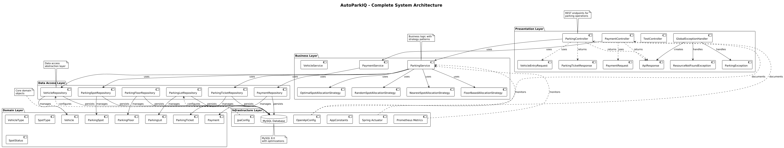
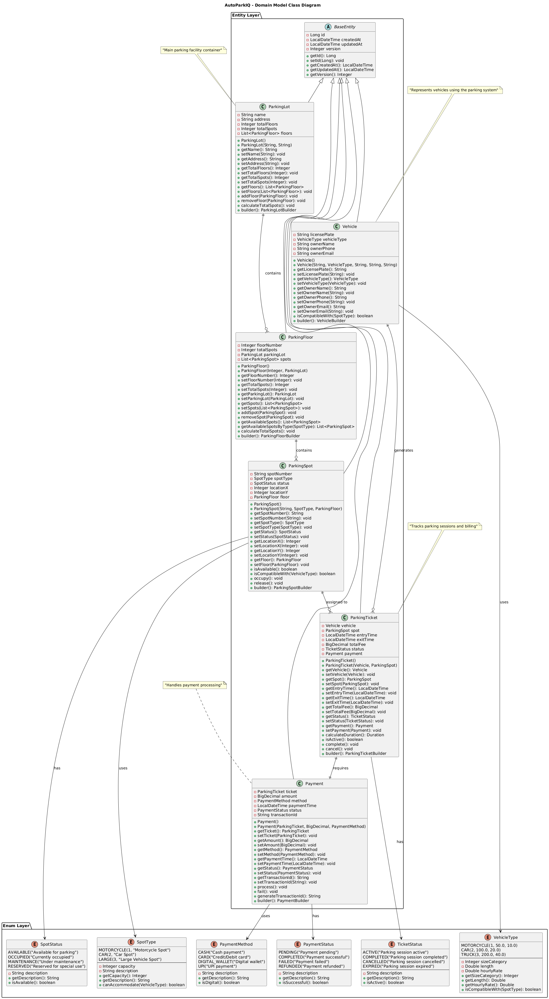
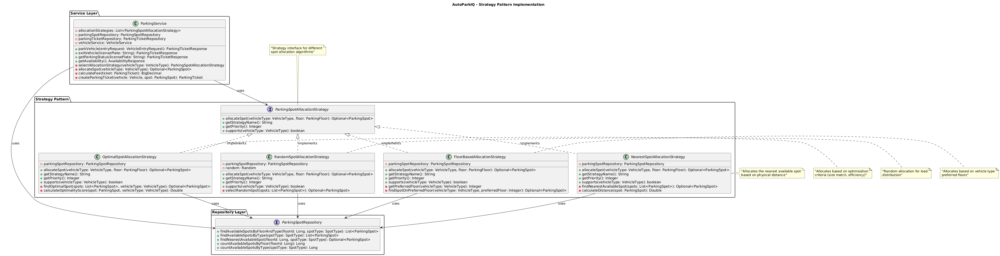
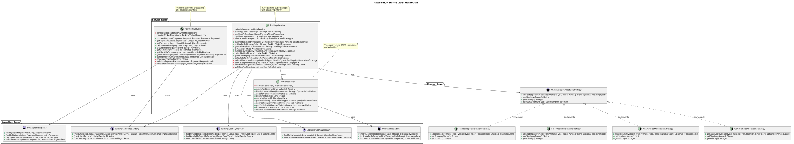
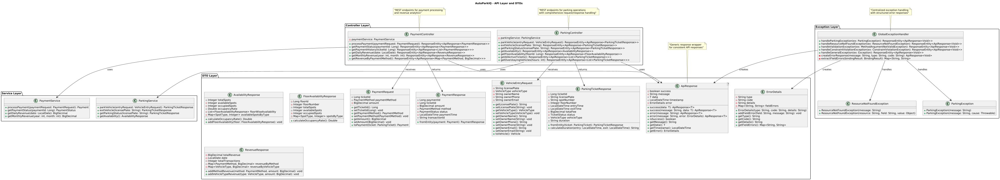

# AutoParkIQ - Smart Parking Management System

[](https://www.oracle.com/java/)
[](https://spring.io/projects/spring-boot)
[](https://www.mysql.com/)
[](https://maven.apache.org/)
[](LICENSE)

## 🅿️ Project Overview

AutoParkIQ is an intelligent parking management system designed to efficiently handle vehicle entry/exit management, parking space allocation, and fee calculation for multi-floor parking lots. The system automatically assigns parking spots based on vehicle size and availability, tracks parking duration, and calculates fees upon exit.

## 🎯 Key Features

- **Smart Spot Allocation**: Multiple allocation strategies (Nearest, Optimal, Random, Floor-based)
- **Real-time Parking Management**: Instant spot availability and allocation
- **Multi-Vehicle Support**: Cars, motorcycles, trucks with size-based allocation
- **Dynamic Fee Calculation**: Hourly/daily rates with vehicle-type pricing
- **Concurrent Operations**: Thread-safe operations with pessimistic locking
- **RESTful APIs**: Comprehensive REST endpoints with Swagger documentation
- **Analytics & Reporting**: Revenue tracking, occupancy reports, utilization metrics
- **Exception Handling**: Comprehensive error management with custom exceptions

## 🏗️ System Architecture

### Project Structure
```
src/main/java/me/razorblack/autoparkiq/
├── AutoParkIqApplication.java          # Main Spring Boot application
├── config/                             # Configuration classes
│   ├── AppConstants.java              # Application constants
│   ├── JpaConfig.java                 # JPA/Database configuration
│   └── OpenApiConfig.java             # Swagger/OpenAPI configuration
├── controller/                         # REST API controllers
│   ├── ParkingController.java         # Parking operations API
│   └── PaymentController.java         # Payment operations API
├── dto/                               # Data Transfer Objects
│   ├── ApiResponse.java               # Standard API response wrapper
│   ├── VehicleEntryRequest.java       # Vehicle entry request DTO
│   ├── PaymentRequest.java            # Payment request DTO
│   └── ParkingTicketResponse.java     # Parking ticket response DTO
├── exception/                          # Custom exceptions
│   ├── GlobalExceptionHandler.java    # Global exception handler
│   ├── ParkingException.java          # Parking business logic exceptions
│   └── ResourceNotFoundException.java # Resource not found exceptions
├── model/                             # Domain entities and enums
│   ├── entity/                        # JPA entities
│   │   ├── BaseEntity.java           # Base entity with audit fields
│   │   ├── Vehicle.java              # Vehicle entity
│   │   ├── ParkingLot.java           # Parking lot entity
│   │   ├── ParkingFloor.java         # Parking floor entity
│   │   ├── ParkingSpot.java          # Parking spot entity
│   │   ├── ParkingTicket.java        # Parking ticket entity
│   │   └── Payment.java              # Payment entity
│   └── enums/                         # System enumerations
│       ├── VehicleType.java          # MOTORCYCLE, CAR, TRUCK
│       ├── SpotType.java             # MOTORCYCLE, CAR, LARGE
│       ├── SpotStatus.java           # AVAILABLE, OCCUPIED, MAINTENANCE
│       ├── TicketStatus.java         # ACTIVE, COMPLETED, CANCELLED
│       ├── PaymentStatus.java        # PENDING, COMPLETED, FAILED
│       └── PaymentMethod.java        # CASH, CARD, DIGITAL_WALLET
├── repository/                        # Data access layer
│   ├── VehicleRepository.java        # Vehicle data operations
│   ├── ParkingLotRepository.java     # Parking lot operations
│   ├── ParkingFloorRepository.java   # Floor operations
│   ├── ParkingSpotRepository.java    # Spot operations & availability
│   ├── ParkingTicketRepository.java  # Ticket operations & analytics
│   └── PaymentRepository.java        # Payment operations & reporting
└── service/                          # Business logic layer
    ├── VehicleService.java           # Vehicle management service
    ├── ParkingService.java           # Core parking operations
    ├── PaymentService.java           # Payment processing service
    └── strategy/                     # Strategy pattern implementations
        ├── ParkingSpotAllocationStrategy.java    # Strategy interface
        ├── NearestSpotAllocationStrategy.java    # Nearest spot algorithm
        ├── OptimalSpotAllocationStrategy.java    # Optimal allocation algorithm
        ├── RandomSpotAllocationStrategy.java     # Random allocation algorithm
        └── FloorBasedAllocationStrategy.java     # Floor-based algorithm

src/main/resources/
├── application.properties            # Application configuration
├── static/                          # Static web resources
└── templates/                       # Template files

sqlQuery/
└── autoparkiq_db.sql               # Database schema with sample data
```

## 📊 System Architecture Diagrams

### Complete System Architecture


### Core Domain Model


### Strategy Pattern Implementation


### Service Layer Architecture


### API Layer Structure


## 🚀 API Endpoints & Examples

### 1. Vehicle Entry
**Endpoint:** `POST /api/v1/parking/entry`

**Request:**
```json
{
    "licensePlate": "KA01AB1234",
    "vehicleType": "CAR",
    "ownerName": "John Doe",
    "ownerPhone": "+91-9876543210",
    "ownerEmail": "john.doe@email.com"
}
```

**Response:**
```json
{
    "success": true,
    "message": "Vehicle entry successful",
    "data": {
        "ticketId": 1,
        "licensePlate": "KA01AB1234",
        "spotNumber": "A101",
        "floorNumber": 1,
        "entryTime": "2025-10-25T10:30:00",
        "vehicleType": "CAR",
        "hourlyRate": 20.00
    },
    "timestamp": "2025-10-25T10:30:00"
}
```

### 2. Vehicle Exit & Payment
**Endpoint:** `POST /api/v1/parking/exit`

**Request:**
```json
{
    "licensePlate": "KA01AB1234"
}
```

**Response:**
```json
{
    "success": true,
    "message": "Vehicle exit successful",
    "data": {
        "ticketId": 1,
        "licensePlate": "KA01AB1234",
        "entryTime": "2025-10-25T10:30:00",
        "exitTime": "2025-10-25T13:45:00",
        "duration": "3 hours 15 minutes",
        "totalFee": 80.00,
        "spotNumber": "A101"
    },
    "timestamp": "2025-10-25T13:45:00"
}
```

### 3. Process Payment
**Endpoint:** `POST /api/v1/payments/process`

**Request:**
```json
{
    "ticketId": 1,
    "paymentMethod": "CARD",
    "amount": 80.00
}
```

**Response:**
```json
{
    "success": true,
    "message": "Payment processed successfully",
    "data": {
        "paymentId": 1,
        "transactionId": "TXN_20251025_001",
        "amount": 80.00,
        "paymentMethod": "CARD",
        "status": "COMPLETED",
        "paymentTime": "2025-10-25T13:45:30"
    },
    "timestamp": "2025-10-25T13:45:30"
}
```

### 4. Check Parking Status
**Endpoint:** `GET /api/v1/parking/status/{licensePlate}`

**Response:**
```json
{
    "success": true,
    "message": "Parking status retrieved successfully",
    "data": {
        "licensePlate": "KA01AB1234",
        "status": "ACTIVE",
        "spotNumber": "A101",
        "floorNumber": 1,
        "entryTime": "2025-10-25T10:30:00",
        "duration": "3 hours 15 minutes",
        "currentFee": 80.00
    },
    "timestamp": "2025-10-25T13:45:00"
}
```

### 5. Real-time Availability
**Endpoint:** `GET /api/v1/parking/availability`

**Response:**
```json
{
    "success": true,
    "message": "Availability information retrieved",
    "data": {
        "totalSpots": 200,
        "availableSpots": 45,
        "occupiedSpots": 155,
        "occupancyRate": 77.5,
        "floorWiseAvailability": [
            {
                "floorNumber": 1,
                "totalSpots": 50,
                "availableSpots": 12,
                "spotsByType": {
                    "MOTORCYCLE": 5,
                    "CAR": 6,
                    "LARGE": 1
                }
            }
        ]
    },
    "timestamp": "2025-10-25T13:45:00"
}
```

## 🔥 Custom Exceptions

### Exception Hierarchy
```java
RuntimeException
├── ParkingException              // Business logic errors
│   ├── "No available spots for vehicle type"
│   ├── "Vehicle already parked"
│   ├── "Invalid parking duration"
│   └── "Payment processing failed"
└── ResourceNotFoundException     // Resource not found errors
    ├── "Vehicle not found with license plate: KA01AB1234"
    ├── "Parking ticket not found with id: 123"
    ├── "Parking spot not found with id: 456"
    └── "Payment not found with id: 789"
```

### Exception Response Format
```json
{
    "success": false,
    "message": "Vehicle not found with license plate: INVALID123",
    "error": {
        "type": "RESOURCE_NOT_FOUND",
        "code": "VEHICLE_NOT_FOUND",
        "details": "The vehicle with the provided license plate does not exist in the system",
        "timestamp": "2025-10-25T13:45:00"
    }
}
```

### Global Exception Handler
The system includes a comprehensive global exception handler that manages:
- **Validation Errors**: Field validation failures with detailed messages
- **Business Logic Errors**: Custom parking exceptions with context
- **Resource Not Found**: Missing entities with helpful error messages
- **System Errors**: Database and runtime exceptions with sanitized responses

## ⚙️ Setup & Installation

### Prerequisites
- **Java 17+** (OpenJDK or Oracle JDK)
- **Maven 3.6+** for dependency management
- **MySQL 8.0+** for database storage
- **IDE** (IntelliJ IDEA, Eclipse, or VS Code)

### Database Setup
1. **Install MySQL 8.0+**
2. **Create Database:**
   ```sql
   CREATE DATABASE autoparkiq_db;
   CREATE USER 'autoparkiq_user'@'localhost' IDENTIFIED BY 'your_password';
   GRANT ALL PRIVILEGES ON autoparkiq_db.* TO 'autoparkiq_user'@'localhost';
   FLUSH PRIVILEGES;
   ```

3. **Run Database Schema:**
   ```bash
   mysql -u autoparkiq_user -p autoparkiq_db < sqlQuery/autoparkiq_db.sql
   ```

### Application Setup

1. **Clone the Repository:**
   ```bash
   git clone https://github.com/razorblack/AutoParkIQ.git
   cd AutoParkIQ
   ```

2. **Configure Database Connection:**
   Update `src/main/resources/application.properties`:
   ```properties
   # Database Configuration
   spring.datasource.url=jdbc:mysql://localhost:3306/autoparkiq_db
   spring.datasource.username=autoparkiq_user
   spring.datasource.password=your_password
   ```

3. **Build the Project:**
   ```bash
   # Using Maven wrapper (recommended)
   ./mvnw clean compile
   
   # Or using Maven directly
   mvn clean compile
   ```

4. **Run Tests:**
   ```bash
   ./mvnw test
   ```

5. **Start the Application:**
   ```bash
   ./mvnw spring-boot:run
   ```

6. **Access the Application:**
   - **Main Application:** http://localhost:8089
   - **API Documentation:** http://localhost:8089/swagger-ui.html
   - **Health Check:** http://localhost:8089/actuator/health

### Development Environment Setup

#### IntelliJ IDEA
1. Import project as Maven project
2. Enable annotation processing for Lombok
3. Set Project SDK to Java 17+
4. Install Lombok plugin

#### VS Code
1. Install Java Extension Pack
2. Install Spring Boot Extension Pack
3. Configure Java SDK path
4. Enable auto-import for Maven dependencies

#### Eclipse
1. Import as Maven project
2. Install Lombok (download lombok.jar and run installer)
3. Set compiler compliance level to 17
4. Enable project facets for Spring

## 📊 Database Schema Details

### Tables Overview
```sql
-- Core Tables
parking_lots           # Parking facility information
parking_floors         # Floor-wise organization
parking_spots         # Individual parking spots
vehicles              # Vehicle master data
parking_tickets      # Parking session records
payments            # Payment transaction records

-- Key Indexes
idx_spot_status_type       # Fast spot availability queries
idx_ticket_license_plate   # Quick vehicle lookup
idx_ticket_entry_time     # Time-based analytics
idx_payment_status        # Payment reporting
```

### Sample Data Included
- **1 Parking Lot** with 3 floors
- **150 Parking Spots** (50 per floor)
- **Mixed Spot Types**: Motorcycle (30%), Car (60%), Large (10%)
- **Sample Vehicles** for testing
- **Demo Parking Sessions** with payment records

## 🧪 Testing Strategy

### Unit Tests
```bash
# Run specific test class
./mvnw test -Dtest=VehicleServiceTest

# Run all tests with coverage
./mvnw test jacoco:report
```

### Integration Tests
```bash
# Test with embedded database
./mvnw test -Dspring.profiles.active=test

# Test specific functionality
./mvnw test -Dtest=ParkingControllerIntegrationTest
```

### API Testing with Postman
Import the provided Postman collection for comprehensive API testing:
- Vehicle entry/exit scenarios
- Payment processing workflows
- Error handling validation
- Concurrent operation testing

## 📈 Performance & Monitoring

### Application Metrics
- **Actuator Endpoints:** `/actuator/health`, `/actuator/metrics`
- **Prometheus Integration:** Metrics export for monitoring
- **Custom Metrics:** Parking utilization, average stay duration
- **Performance Monitoring:** Database connection pool metrics

### Database Optimization
- **Connection Pooling:** HikariCP with optimized settings
- **Query Optimization:** Indexed queries for spot allocation
- **Pessimistic Locking:** Prevents race conditions
- **Batch Operations:** Efficient bulk data processing

### Health Checks
The application provides comprehensive health checks:
- Database connectivity
- Disk space availability
- Memory usage monitoring
- Custom parking system health indicators

## 🤝 Contributing

### Development Workflow
1. **Fork** the repository
2. **Create** feature branch: `git checkout -b feature/new-feature`
3. **Implement** changes with tests
4. **Run** tests: `./mvnw test`
5. **Commit** changes: `git commit -am 'Add new feature'`
6. **Push** to branch: `git push origin feature/new-feature`
7. **Submit** pull request

### Code Standards
- **Java Style Guide:** Google Java Style
- **Documentation:** Comprehensive JavaDoc

## 📄 License

This project is licensed under the MIT License - see the [LICENSE](LICENSE) file for details.

## 📧 Support & Contact

- **Issues:** [GitHub Issues](https://github.com/razorblack/AutoParkIQ/issues)
- **Discussions:** [GitHub Discussions](https://github.com/razorblack/AutoParkIQ/discussions)

---

**AutoParkIQ** - Making parking intelligent, one spot at a time! 🅿️✨